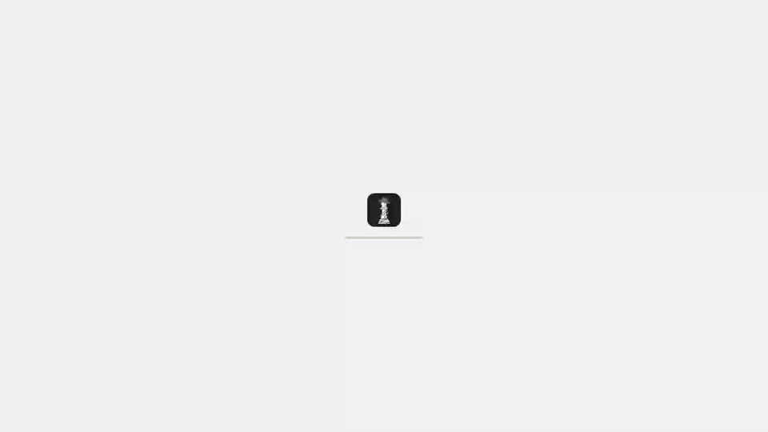
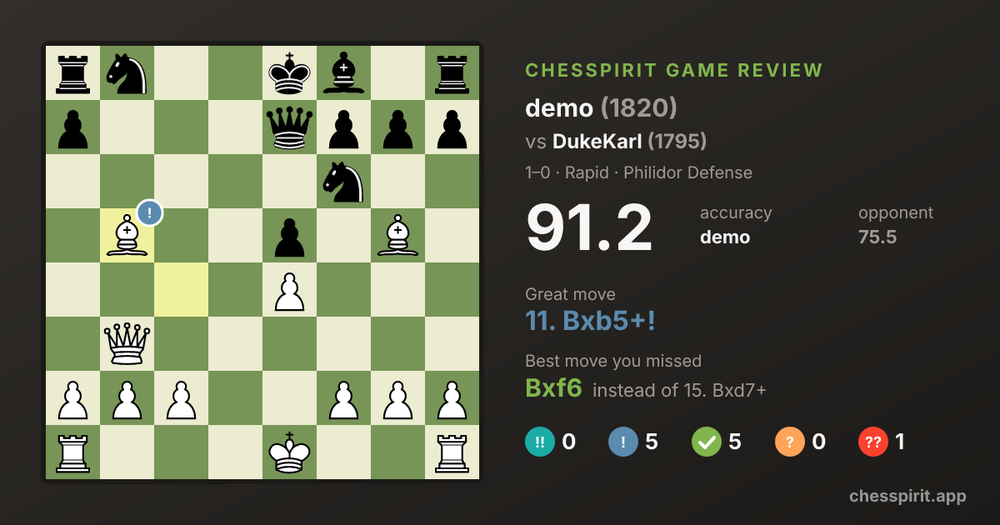
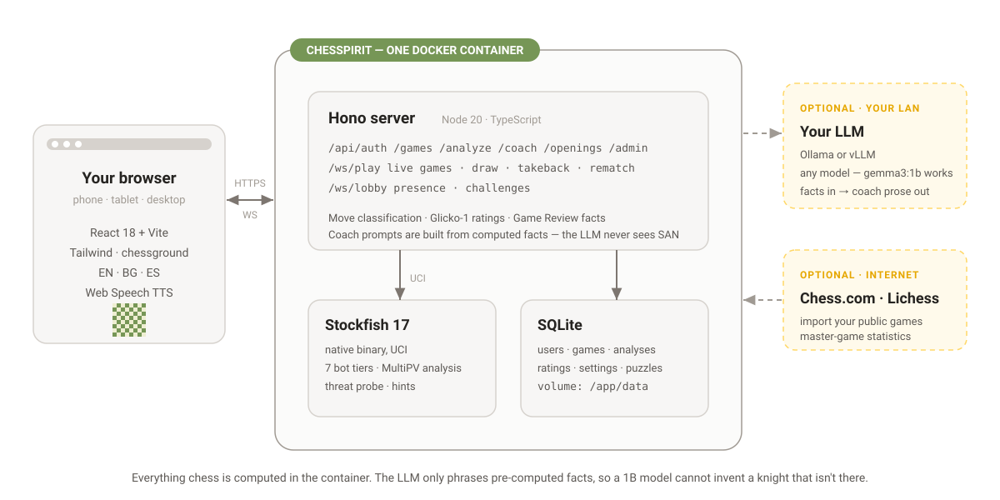

<p align="center">
  
</p>

<h1 align="center">Chesspirit</h1>

<p align="center">
  <b>English</b> · <a href="README.fa.md">فارسی</a>
</p>

<p align="center">
  <b>Free, unlimited chess game reviews.</b> Stockfish grades every move of your Chess.com or Lichess games, shows where the game turned, and turns your blunders into puzzles.<br/>
  Open source (MIT). Use it at <a href="https://chesspirit.app">chesspirit.app</a> or run it yourself in one Docker container.<br/>
  An AI coach explains your mistakes if you connect a model of your own (Ollama, vLLM or DeepSeek); everything else works without one.
</p>

<p align="center">
  <a href="https://chesspirit.app/try"><b>Try it with your username →</b></a>
  &nbsp;·&nbsp;
  <a href="#run-it-yourself">Run it yourself</a>
</p>

<p align="center">
  <a href="https://github.com/aminghuf/chesspirit/releases"></a>
  <a href="https://github.com/aminghuf/chesspirit/pkgs/container/chesspirit"></a>
  <a href="LICENSE"></a>
  <a href="https://github.com/aminghuf/chesspirit/actions/workflows/ci.yml"></a>
  <a href="https://github.com/aminghuf/chesspirit/stargazers"></a>
</p>

<p align="center">
  
  <br/>
  <sub>Username → your last games → every move graded → your worst move as a puzzle. <i>Recorded on a local instance with historical games.</i></sub>
</p>

## Try it

**[chesspirit.app/try](https://chesspirit.app/try)** — type any public Chess.com or Lichess username, pick one of the last ten games, and get the full review in about a minute. No account. Each review gets a link you can share. Register on the site to import your whole history and keep everything.

Free Chess.com accounts get one full Game Review a day ([Chess.com Help Center](https://support.chess.com/en/articles/8562418-what-does-each-level-of-membership-get-me), checked 8 October 2026). Chesspirit has no limit.

## Run it yourself

One command, Docker only:

```bash
docker run -d -p 8800:8800 -v chesspirit-data:/app/data --name chesspirit ghcr.io/aminghuf/chesspirit:latest
```

Or let the installer check for Docker and run that for you ([read it first](install.sh)):

```bash
curl -fsSL https://raw.githubusercontent.com/aminghuf/chesspirit/main/install.sh | sh
```

Open <http://localhost:8800>; a setup wizard creates the admin account. Your games stay in the `chesspirit-data` volume and never leave the machine. More options — `docker compose`, building from source, Codespaces — are under [First run](#first-run-in-five-minutes).

## What works without an LLM

Almost everything. The AI model only writes the coach's words; the engine work is Stockfish and chess.js.

| Works out of the box | Needs your own model |
| --- | --- |
| Game Review: every move classified (Brilliant → Blunder), accuracy, estimated Elo, eval graph, key moments, engine lines | The AI Coach's explanations in plain words |
| Chess.com and Lichess import, automatic sync, PGN paste | Automatic written game reports |
| Puzzles: the Lichess database by theme, and your own blunders | |
| Play vs Stockfish (seven levels), play a friend on the same server | |
| Learn (69 lessons), opening trainer, insights, shareable review links | |

Without a model the *Coach* panel shows the engine facts as plain text. Each user adds their own model in *Settings → Connections*.

## Share a review

Any analysed game can be shared: *Share review* on the review page makes a public link (`/r/…?utm_source=share`) and a PNG card with the accuracy, the best moment and the move you missed. The link unfurls with that card on chat apps and social sites. *Stop sharing* deletes it.

<p align="center">
  
</p>

## How it's built

<p align="center">
  <picture>
    <source media="(prefers-color-scheme: dark)" srcset="docs/diagrams/architecture-dark.svg">
    
  </picture>
</p>

One container: a [Hono](https://hono.dev) server, native Stockfish and a single SQLite file. The coach teaches from facts it is handed and never analyses on its own: the server works out what a move allows, hangs, wins or stops (chess.js, [server/src/coach/tactics.ts](server/src/coach/tactics.ts)), the opponent's best answer and the alternatives (Stockfish), and the player's recurring mistakes ([server/src/coach/memory.ts](server/src/coach/memory.ts)), and the LLM turns that into coaching ([server/src/coach/coaching.ts](server/src/coach/coaching.ts)). Every answer is checked against the engine's verdict before it is shown, so a small local model is enough.

## Origins & credits

Chesspirit began as a fork of **[Patzer](https://github.com/SikamikanikoBG/patzer)** by [SikamikanikoBG](https://github.com/SikamikanikoBG), released under the MIT license, and has been developed independently here since 7.0.0 (October 2026). Patzer's copyright notice is kept in [LICENSE](LICENSE) next to Chesspirit's, its history is in the [changelog](CHANGELOG.md) (everything from 7.18.0 down), and everyone who has sent code to either project is in [CONTRIBUTORS.md](CONTRIBUTORS.md). Thank you.

Also standing on: [Stockfish](https://stockfishchess.org/), [chessground](https://github.com/lichess-org/chessground) and the [Lichess puzzle database](https://database.lichess.org/#puzzles) — see [THIRD_PARTY_NOTICES.md](THIRD_PARTY_NOTICES.md).

## Roadmap

Next up: master-game stats when Lichess reopens its explorer API, more languages, a capped demo coach on chesspirit.app, and federated play between separate Chesspirit servers. Out of scope: variants and a multi-tenant SaaS. The full list, with what shipped recently, is in [ROADMAP.md](ROADMAP.md).

## Why Chesspirit

- **Your games stay home.** Single Docker container on a Pi / NAS / old laptop. No cloud, no telemetry, no upsell.
- **Bring your own LLM.** The AI coach runs against your own [Ollama](https://ollama.com) or [vLLM](https://docs.vllm.ai) host. The coach teaches, but never analyses: Stockfish, chess.js and your own game history work out the facts server-side, so a small local model can't hallucinate moves or pieces.
- **Made for a household, not a stadium.** Multi-user with admin console, per-profile language, kid-mode blunder warnings, "horsey" piece names for the youngest profiles.

## What it is

Chesspirit is a tiny, self-hosted take on the Chess.com / Lichess workflow you actually use:

- **Game Review** — pull your public Chess.com or Lichess games (or paste a PGN; both Chess.com and Lichess games can sync on their own), analyze with bundled Stockfish, get chess.com-style classifications (Brilliant / Great / Best / Excellent / Good / Book / Inaccuracy / Mistake / Miss / Blunder), accuracy %, estimated Elo, eval graph, key moments, top engine lines, a "What's the threat?" probe, and master-game statistics for the position. Import your whole history in one go, then filter the list by period, site, result, colour and time control. Move the pieces on the review board to try a different move and see the engine's verdict on it — evaluation, top lines, and arrows for what it preferred and what it would play next. Click a count in the move table (say, *Blunder 2*) to list those moves and jump to them; the mating move gets its own `#` badge and sound; and a game the engine is still working on shows *Analyzing…* in the list instead of inviting a second click.
- **Your choice of engine** — Game Review runs on the bundled Stockfish (locally, or on the hosted chess-api.com), or on an engine an admin downloads with one click in *Admin → System*: Stockfish 19, Reckless, Viridithas or Avalanche. Downloads come from the projects' official releases and are checked against a pinned checksum before they run. The same page sets the default analysis depth.
- **Puzzles** — the Lichess puzzle database (~5 million puzzles, CC0), filtered by the same themes as lichess.org/training/themes (forks, pins, mate in 2, rook endgames, smothered mate…) at five difficulties around your own puzzle rating. Play them *online* straight from Hugging Face with nothing to download, or let an admin download the database once so every theme is instant and works offline.
- **Tactic Trainer** — puzzles cut from your own analysed games: the positions where you blundered, retried until you find the move.
- **Play vs Bot** — full games against Stockfish at seven named tiers (Kid → Stockfish max), all standard time controls, a queue of up to six premoves shown on the board, kid-mode blunder warnings.
- **Play vs Friend** — real-time PvP between profiles on the same server over WebSocket, with draw offers, takebacks and one-click rematch. Playing across the internet is a tunnel away — see the [FAQ](docs/FAQ.md#can-i-play-a-friend-who-lives-somewhere-else).
- **Players & profiles** — a directory of everyone on your server with a rating leaderboard, live presence and public profiles (record, per-time-class ratings, your head-to-head), challenge-from-profile, and a "missed invitations" rail.
- **AI Coach (your LLM)** — point at any [Ollama](https://ollama.com) or [vLLM](https://docs.vllm.ai) host (or, if you have no GPU to spare, the hosted DeepSeek API). A coach, not a commentator: it explains *why* a move works or fails (what it allows, hangs or wins, and the opponent's best answer), shows the better move and other good ones with what they achieve, connects the mistake to your own recent games ("4 of your last 10 games: leaving a piece unprotected", your weakest phase, positions you missed in the opening trainer) and links a matching Learn lesson. Hints point you at what matters without giving the move away. It never contradicts the engine: an answer that praises a mistake is caught before you see it. Audience-tuned for Kid / Beginner / Intermediate / Advanced.
- **Family-ready** — multi-user with admin console, open / invite-only / closed sign-up, per-profile language, kid-mode blunder warnings, "horsey" piece names for the youngest profiles.
- **Learn (beta)** — 69 interactive lessons in four levels, from how the pieces move to tactics, mating patterns and endgames. Stars and progress per profile; kid mode tells the same lessons in simpler words.
- **Opening trainer (beta)** — drill 16 built-in main lines or any line from your own repertoire; the moves you miss come back in a daily review queue.
- **Multilingual** — English, Bulgarian, Spanish, German, Russian and Persian (فارسی) out of the box, UI *and* coach prompts. Persian is complete down to every Learn lesson, with a right-to-left layout (the board and moves stay left to right) and the bundled Vazirmatn font. Adding a language is one table entry per file — see CONTRIBUTING.
- **Self-hosted, single container** — runs on a Pi, a NAS, an old laptop. Your games never leave home.
- **Phone-friendly** — full-width board, sticky action bar and a swipe-up move list on small screens.
- **Tells you when it's stale** — a self-hosted app can't update itself, but Chesspirit checks GitHub every six hours and shows a one-line notice when a newer release is out, so you know to pull. Sends nothing about you; switch it off in *Admin → System*.

## Screenshots

<table>
<tr>
<td width="50%" valign="top">

<br/><sub><b>Player profile</b> — lifetime record, per-time-class ratings, your head-to-head, and a one-click challenge.</sub>
</td>
<td width="50%" valign="top">

<br/><sub><b>Home</b> — your stats, today's puzzle, this week's plan, achievements and recent games.</sub>
</td>
</tr>
<tr>
<td width="50%" valign="top">

<br/><sub><b>Players</b> — everyone on your server, sorted by rating, with live presence and missed invitations.</sub>
</td>
<td width="50%" valign="top">

<br/><sub><b>Play</b> — seven Stockfish tiers, all time controls, or a live challenge to a friend.</sub>
</td>
</tr>
</table>

Dark mode is built in (auto / light / dark, per profile):

<table>
<tr>
<td width="50%" valign="top"></td>
<td width="50%" valign="top"></td>
</tr>
</table>

<sub>All screenshots use anonymized demo data — no real accounts or hostnames.</sub>

## First run in five minutes

Pick **one** of these. The Docker options open <http://localhost:8800>; the Codespaces option opens in your browser. Either way, the first visit walks you through a setup wizard.

**Try it in your browser**

[](https://codespaces.new/aminghuf/chesspirit?quickstart=1)

Spins up a temporary Codespace with Chesspirit + Stockfish pre-installed. Wait ~60 seconds for `npm install` + dev server to start, then click the forwarded port labelled *"Chesspirit (Vite dev — open this)"*. You get the full app **except** the AI Coach narration (which needs an Ollama host on your network — see below).

**`docker run`**

```bash
docker run -d \
  -p 8800:8800 \
  -v chesspirit-data:/app/data \
  --name chesspirit \
  ghcr.io/aminghuf/chesspirit:latest
```

**`docker compose`**

```yaml
services:
  chesspirit:
    image: ghcr.io/aminghuf/chesspirit:latest
    container_name: chesspirit
    restart: unless-stopped
    ports:
      - "8800:8800"
    volumes:
      - chesspirit-data:/app/data
volumes:
  chesspirit-data:
```

> **What works without any extras:** play vs Stockfish, play vs friend on the same server,
> move classification, accuracy %, eval graph, opening detection. The setup wizard takes you
> straight to a working board.
>
> **What needs an LLM:** the AI Coach commentary voice. Until you point Chesspirit at an Ollama or
> vLLM host, the *Coach* panel just shows the engine facts in plain text.
>
> **What needs a Chess.com or Lichess username:** importing your public games for review. Without it
> you can still load PGNs by paste or play live and review from the move list. Once a username is set,
> Chesspirit can pull new games automatically on an interval you pick in *Settings → Automation*.

You'll want, optionally:

- **For the AI Coach:** each user adds their own model in *Settings → Connections* and pays for their own use — there is no shared, server-wide model. Any user can add a [DeepSeek](https://platform.deepseek.com) API key. An [Ollama](https://ollama.com) or [vLLM](https://docs.vllm.ai) server reachable from the Chesspirit container works too: for admins always (the setup wizard saves the one you enter as the first admin's own), and for other users once an admin switches it on in *Admin → System*.
- **For Game Review on your own games:** a Chess.com and/or Lichess username (entered later in *Settings*).

To use a different host port, run with `-p 9000:8800` (or set `HOST_PORT=9000` if you're using `docker compose`).

If you're terminating TLS at a reverse proxy, set `COOKIE_SECURE=true` in the container's environment so session cookies aren't shipped over plaintext HTTP.

## Android app

There is an Android app in [`mobile/`](mobile/). It asks for your server's address once and then runs that server's Chesspirit, so it works with any instance — on the internet or on your home network. It also has an offline mode that needs no server: a game against Stockfish running on the phone, an analysis board, and 4,070 Lichess puzzles.

Get the APK from the [releases page](https://github.com/aminghuf/chesspirit/releases), or build it yourself — only Docker is needed:

```bash
./mobile/build-apk.sh   # → mobile/dist/chesspirit-debug.apk
```

## Compared to alternatives

|                        | Chesspirit | Lichess Studio | Chess.com Review | Aimchess |
| ---------------------- | :----: | :------------: | :--------------: | :------: |
| Self-hosted            |   ✅   |       ❌        |        ❌         |    ❌    |
| LLM coach (BYO model)  |   ✅   |       ❌        |        ❌         |    ❌    |
| Imports Chess.com      |   ✅   |       ❌        |        ✅         |    ✅    |
| Imports Lichess        |   ✅   |       ✅        |        ❌         |    ✅    |
| Multi-user / family    |   ✅   |       ❌        |        ❌         |    ❌    |
| Multilingual coach     |   ✅   |  partial UI    |        ❌         |    ❌    |
| Free                   |   ✅   |       ✅        |        💳         |    💳    |
| Full reviews, free plan | unlimited | unlimited    |   1 a day¹        |    —     |

¹ [Chess.com Help Center](https://support.chess.com/en/articles/8562418-what-does-each-level-of-membership-get-me): Basic (free) members get "1 full game review analysis per day". Checked 8 October 2026.

## Local development

Requirements: Node.js ≥ 20.11.

```bash
git clone https://github.com/aminghuf/chesspirit.git
cd chesspirit
npm install
npm run setup   # downloads Stockfish 17 into ./bin/ (Windows, Linux, macOS)
npm run dev
```

- Server: <http://localhost:8800>
- Vite dev server (HMR): <http://localhost:5173> — proxies `/api` and `/ws` to the server.

`npm run setup` dispatches to `setup.ps1` (Windows) or `setup.sh` (Linux/macOS) and picks the official
build for your CPU; on an older x86 CPU without AVX2 run `STOCKFISH_ASSET=stockfish-ubuntu-x86-64-sse41-popcnt npm run setup`.
A package-manager Stockfish (`apt install stockfish` / `brew install stockfish`) works too — the server
also looks in `/usr/bin`, `/usr/local/bin`, `/opt/homebrew/bin` and `/usr/games`.

Useful scripts:

```bash
npm run typecheck   # tsc -b across server + web + tests (no emit)
npm test            # vitest — classifier, Glicko, PGN round-trip, explorer, PvP helpers
npm run test:e2e    # boots a real server on a scratch DB and plays a PvP game over two sockets
npm run build       # production build of both workspaces
```

## Deploying to a home server

The published image plus the `docker compose` snippet above is all most people need — add the
[Watchtower](https://containrrr.dev/watchtower/) label and your box tracks releases by itself.
If you'd rather build from source on the target, two equivalent scripts are bundled — `deploy.ps1` for Windows hosts,
`deploy.sh` for Linux / macOS hosts. Both tar the source, scp it to the
target, then run `docker compose build && up -d` over SSH.

Create `.env.deploy` (gitignored) on the workstation you're deploying *from*:

```
HOST=user@192.168.x.x
REMOTE_DIR=/home/user/chesspirit
SUDO_PASS=... # only if your user is not in the docker group on the target
HOST_PORT=8800
```

Then:

```powershell
# Windows
.\deploy.ps1            # tar source → ssh, build & start
.\deploy.ps1 -NoBuild   # restart without rebuilding
.\deploy.ps1 -Logs      # tail logs after deploy
```

```bash
# Linux / macOS
./deploy.sh             # tar source → ssh, build & start
./deploy.sh --no-build  # restart without rebuilding
./deploy.sh --logs      # tail logs after deploy
```

## Configuration

All user-facing configuration is done **through the UI** and persisted in SQLite. The only environment variables are operational:

| Var | Default | What it does |
|---|---|---|
| `PORT` | `8800` | HTTP listen port |
| `HOST` | `0.0.0.0` | Bind address |
| `DB_PATH` | `./data/chess.db` | SQLite database file |
| `STOCKFISH_PATH` | (auto) | Override Stockfish binary path |
| `LICHESS_EXPLORER_URL` | `https://explorer.lichess.ovh` | Opening-explorer upstream for the *Master games* panel (a self-hosted `lila-openingexplorer` works) |
| `LICHESS_EXPLORER_TOKEN` | (none) | A Lichess API token for the *Master games* panel, used for anyone who has not added their own in *Settings → Connections*. Lichess refuses explorer requests without one |
| `UPDATE_CHECK` | `1` | Set to `0` to disable the six-hourly "a newer release exists" check for the whole deployment (there's also a toggle in *Admin → System*) |
| `SESSION_SECRET` | (auto-generated) | Cookie signing secret. Persisted on first run. |
| `COOKIE_SECURE`  | `false` | Set to `true` when terminating TLS at a reverse proxy so session cookies are flagged `Secure`. |
| `ENGINE_BACKEND` | `local` | `chessapi` sends Game Review positions to the hosted chess-api.com engine instead of the bundled Stockfish (also a toggle in *Admin → System*; the env var wins over the UI setting, and while it is set analysis stays on Stockfish even if another engine is selected there) |
| `CHESSCOM_SYNC_MINUTES` | `15` | Default Chess.com auto-sync interval (minutes) applied when a profile's setting is first created. The live interval is per-profile under *Settings → Automation* (Lichess has its own too); `0` makes auto-sync opt-in |
| `PUBLIC_SITE` | `false` | `true` makes this a public instance like chesspirit.app: logged-out visitors get the landing page instead of the login form, and can review a public Chess.com / Lichess game without an account (`/try`, rate-limited, one analysis at a time). Leave it off for a household server |
| `TRY_DEPTH` | `14` | Engine depth for those account-free reviews |
| `PUBLIC_BASE_URL` | (from the request) | Absolute base for share links, Open Graph tags and emails, e.g. `https://chesspirit.app` (*Admin → System* can set it too) |
| `UMAMI_WEBSITE_ID` | (none) | Adds the [Umami](https://umami.is) script (cookieless page counts) and opens the CSP to it. Unset = no analytics at all; only an operator of a public site sets this |

System settings (the analysis engine and its default depth, Stockfish path override, who can sign up, whether users may enter their own Ollama/vLLM address) live in *Admin → System*; invites in *Admin → Users*. Engines downloaded there are stored in `engines/` next to the database, so they survive image updates as long as the data volume does; downloads are available when Chesspirit runs on Linux (the Docker image), and bot play always uses the bundled Stockfish.
Per-profile settings (language, audience, coach behavior, TTS voice, sound sets, Chess.com / Lichess usernames) live in *Settings*, alongside the *Automation* section: a toggle to write the AI review automatically when a game finishes, and a per-site auto-sync interval for Chess.com and Lichess. *Settings → Connections* holds each user's own coach model and Lichess API token; both are stored on the server and never sent back to the browser.

## How move classification works

Each played move is compared against the engine's best move at the same position. We compute the **win-percentage drop** using the Lichess sigmoid (`50 + 50 · (2 / (1 + exp(-0.00368208 · cp)) − 1)`) and combine it with real centipawn loss as a guard against lopsided positions:

| Classification | Rule |
| --- | --- |
| Best ★ | the engine's #1 move |
| Excellent ✓ | win-% drop < 2 **and** cp loss < 50 |
| Good · | win-% drop < 5 **and** cp loss < 100 |
| Inaccuracy ?! | win-% drop < 10 |
| Mistake ? | win-% drop < 20 |
| Blunder ?? | win-% drop ≥ 20 |

On top of that ladder: **Forced** (only one legal move) and **Book** (the position is in the bundled ECO table) replace the label; **Brilliant** `!!` is the engine's #1 move that leaves ≥ a minor piece en prise — measured with a static exchange evaluation, net of what the move captured — in a position that isn't already crushing, where the engine line doesn't just win the material back; **Great** `!` is the engine's #1 when the second-best move is ≥ 200 cp worse, or a move that lifts a lost position back to equal; **Miss** flags a mistake-or-worse that threw away a clearly winning eval or a forced mate. Same-sign mate transitions (+M3 → +M2) cost nothing. Per-game accuracy is the Lichess formula `103.1668 · exp(-0.04354 · Δwin%) − 3.1669`, clamped to `[0, 100]`, excluding book and forced moves.

Estimated Elo comes from average centipawn loss on a piecewise curve calibrated against chess.com Game Review (ACPL 8 → 2700, 18 → 2200, 25 → 1900, 35 → 1600, 50 → 1400, 70 → 1200, 100 → 900, 150 → 600), with accuracy nudging it ±20 Elo at most. The per-game *performance rating* additionally blends in the opponent's rating, weighted by how settled that rating is. All of this is unit-tested — see `server/test/classifier.test.ts`.

## Tech

- **Server:** Node 20 · TypeScript · [Hono](https://hono.dev) · [better-sqlite3](https://github.com/WiseLibs/better-sqlite3) · [chess.js](https://github.com/jhlywa/chess.js) · `ws` · native [Stockfish](https://stockfishchess.org/)
- **Web:** React 18 · Vite · Tailwind CSS · [chessground](https://github.com/lichess-org/chessground) · framer-motion · react-i18next · TanStack Query
- **Coach:** [Ollama](https://ollama.com) or [vLLM](https://docs.vllm.ai) (default model: `gemma3:1b`; something like `qwen2.5:7b` gives a nicer voice)
- **Tests:** [vitest](https://vitest.dev) unit suites + an end-to-end PvP run against a real server
- **TTS:** browser Web Speech API (uses installed OS voices)
- **Persistence:** single SQLite file in `./data/`

## Troubleshooting

- **"Stockfish binary not found"** — Chesspirit no longer falls back to a bare `stockfish` PATH lookup (defense-in-depth: a malicious binary earlier in `$PATH` would otherwise run as the server user). Either install Stockfish into `/usr/games/stockfish`, `/usr/local/bin/stockfish`, `/opt/homebrew/bin/stockfish`, or `bin/stockfish` in the project, or set `STOCKFISH_PATH` (env) / *Admin → System → Stockfish path*.
- **"Ollama unreachable" / "fetch failed"** — inside Docker, `localhost` is the Chesspirit container itself, not your computer. Two things have to line up:
  1. **Ollama listens on the network.** By default it only answers on its own machine's loopback. Set `OLLAMA_HOST=0.0.0.0` (Windows: a user environment variable, then quit and restart Ollama from the tray; Linux: `sudo systemctl edit ollama` → `Environment="OLLAMA_HOST=0.0.0.0"`, then restart the service).
  2. **Chesspirit uses an address that reaches it.** Same machine: `http://host.docker.internal:11434` — built into Docker Desktop on Windows/Mac; on Linux uncomment the `extra_hosts` lines in `docker-compose.yml`, or add `--add-host=host.docker.internal:host-gateway` to `docker run`. Another machine: its LAN IP, e.g. `http://192.168.1.20:11434`.

  The setup wizard and *Admin → System* show this hint when the test fails. The setup-time test only allows loopback / RFC1918 / `*.local` / `host.docker.internal` URLs. After setup, change it any time in *Admin → System*.
- **Port 8800 already in use** — `-p 9000:8800` (docker run) or `HOST_PORT=9000 docker compose up -d`.
- **Lost your admin password** — there is no in-app reset yet. Until one ships, edit `chess.db` directly: open `data/chess.db` with `sqlite3` and replace the row's `password_hash` with a `bcryptjs` hash (cost ≥ 12).
- **Cookies dropped behind a reverse proxy** — see `COOKIE_SECURE=true` above. The cookie also requires the same hostname for both the page and the API.

## More

- **[FAQ](docs/FAQ.md)** — what Chesspirit is and isn't, Chess.com API legality, playing a friend across the internet, NAT/proxy notes, backup, "I lost my admin password", language additions.
- **[Roadmap](ROADMAP.md)** — what's queued and what's deliberately out of scope.
- **[Changelog](CHANGELOG.md)** — every release, with why-not-just-what entries.

## Contributing

PRs welcome — please read [CONTRIBUTING.md](CONTRIBUTING.md) first. Translations especially encouraged.

Chesspirit is better for the people who have already sent code — thank you to everyone in [CONTRIBUTORS.md](CONTRIBUTORS.md).

## Security

See [SECURITY.md](SECURITY.md). For vulnerabilities, **don't** open a public issue — use [GitHub's private vulnerability reporting](https://github.com/aminghuf/chesspirit/security/advisories/new).

## License

MIT — see [LICENSE](./LICENSE). Note the GPL-3.0 components (chessground, Stockfish) — see [THIRD_PARTY_NOTICES.md](THIRD_PARTY_NOTICES.md).
